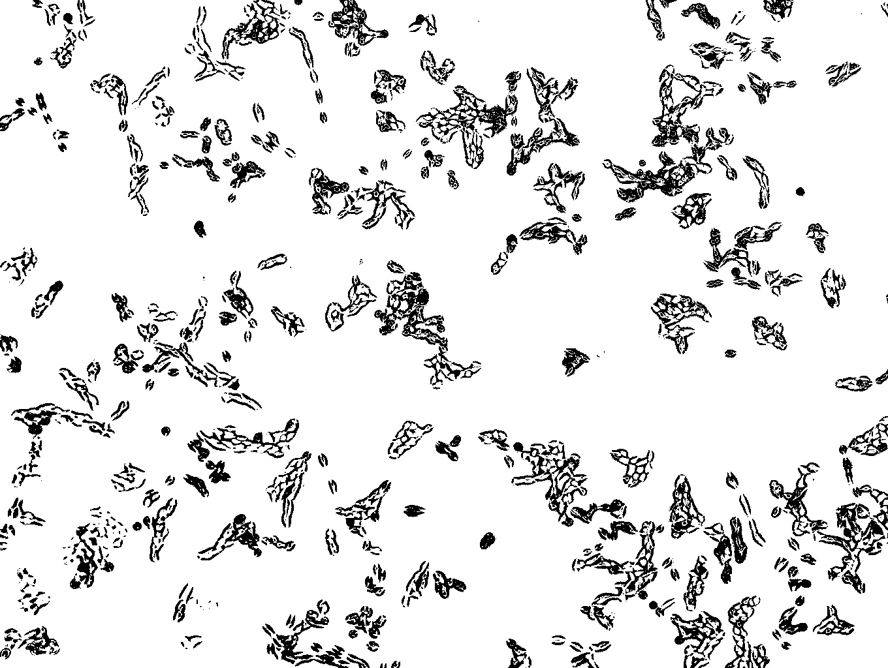
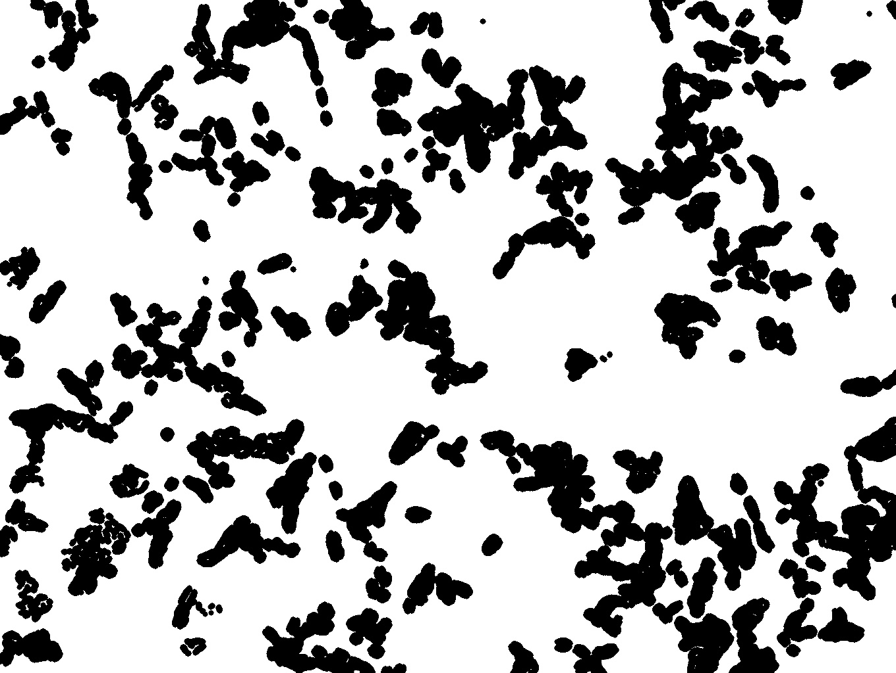
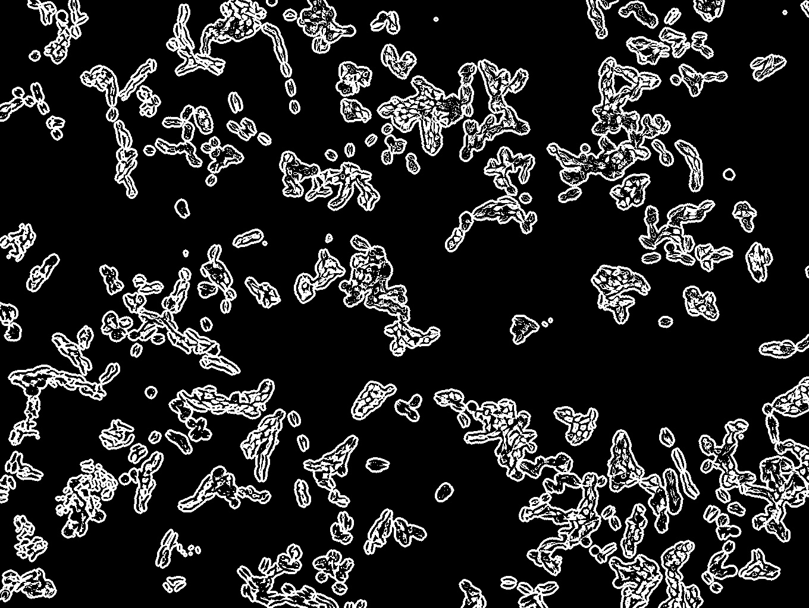

# Automatic-cell-image-classification-with-CNN

## Preprocessing
> Segmentation
>    * Using openCV and the Watershade Algorithm
>    * watershed algorithem
>    >  이미지를 Grayscale로 변환하면 각 Pixel의 값(0 ~255)을 지형의 높낮이로 비유한다. 높은 부분을 봉우리, 낮은 부분을 계곡이라고 볼 수 있다. 그곳을 서로 다른 색의 물로 채우다보면 나중에는 물이 섞인다. 따라서 그 부분에 경계선을 만들어 서로 섞이지 않게 하는 방법이 Watershed 알고리즘이다. 바로 그 경계선을 이미지의 구분지점으로 파악하여 이미지 분할을 한다.
<pre>
<code>
img = cv2.imread(path_dir+name)
    data_count+=1
    gray = cv2.cvtColor(img,cv2.COLOR_BGR2GRAY)

    ret,img_result1 = cv2.threshold(gray, 130, 255, cv2.THRESH_BINARY | cv2.THRESH_OTSU)
    img_result1[985:,1262:]=0
    ##img_result2 = cv2.adaptiveThreshold(img_result1, 255, cv2.ADAPTIVE_THRESH_MEAN_C, cv2.THRESH_BINARY_INV,7,30)
    ret, img_result2 = cv2.threshold(img_result1, 0, 255, cv2.THRESH_BINARY_INV + cv2.THRESH_OTSU)
</code>
</pre>

<pre>
<code>
kernel = np.ones((1,1),np.uint8)
opening = cv2.morphologyEx(thresh,cv2.MORPH_OPEN,kernel, iterations = 2)
sure_bg = cv2.dilate(opening,kernel,iterations=3)
</code>
</pre>

<pre>
<code>
dist_transform = cv2.distanceTransform(opening, cv2.DIST_L2, 5)
result_dist_transform = cv2.normalize(dist_transform, None, 255, 0, cv2.NORM_MINMAX, cv2.CV_8UC1)
ret, sure_fg = cv2.threshold(dist_transform, 0.03*dist_transform.max(),255, cv2.THRESH_BINARY)
</code>
</pre>

<pre>
<code>
sure_fg = np.uint8(sure_fg)
unknown = cv2.subtract(sure_bg,sure_fg)
</code>
</pre>

<pre>
<code>
# Marker labelling
ret, markers = cv2.connectedComponents(sure_fg)
# Add one to all labels so that sure background is not 0, but 1
markers = markers+
# Now, mark the region of unknown with zero
markers[unknown==255] = 0
#markers = cv2.watershed(img, markers)
# Implement watershed algorithm
markers1 = cv2.watershed(img, markers)
img[markers1 == -1] = [255, 0, 0]
</code>
</pre>
 ! [Alt text](./img/watershed_example.jpg "segmentation_example")
