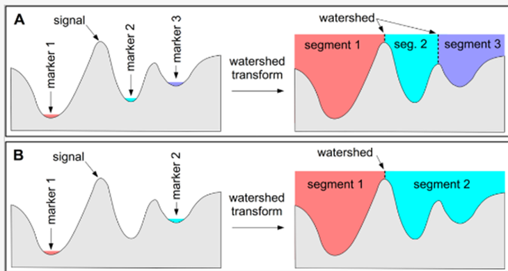
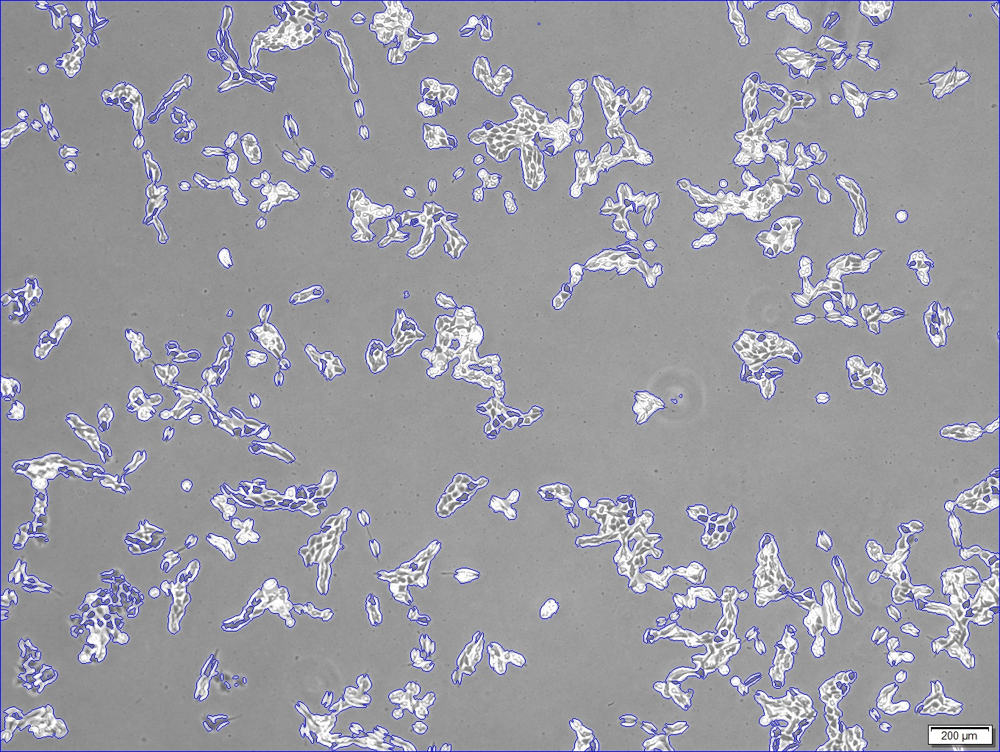

# CNN을 이용한 암세포 분류 프로세스 개발

---------  
## 목표
과거 정상 세포와 비정상 세포의 분류 연구는 단순히 사용자의 의료적 지식을 기반으로 세포를 분류하는 수작업의 방식을 사용하였다. 이와 같은 방식은 사용자가 전문적 지식이 있어야 하므로 전문가에게 의존되고, 암세포 판단 업무의 과중은 결과의 오진으로 이어질 가능성이 존재한다. CNN을 기반으로 한 영상 인식 및 분류에 관한 연구 모델은 현미경 영상의 유사분열 세포 검출, 종양 검출, 신경망 분할, 피부질환 등과 같은 생체의학 영상 분석과 같은 다양한 분야의 활용이 가능하며, 이는 질병의 진단과 최선의 치료 방법 제공에 활용되어 오진율을 줄이는 데 사용되고 있다.
본 연구에서는 현미경 영상 특성 분석에 성능이 우수한 **CNN 기반 암세포 영상 분류 기법**을 제안한다. 동일 조건에서 현미경을 통해 획득된 hela, huh-7, MCF-7, NCI 세포를 분류 알고리즘에 적합하도록 OpenCV(Open Source Computer Vision)를 통해 전처리를 진행하였다. 실시간 컴퓨터 비전을 목적으로 한 Python 라이브러리인 **OpenCV**와 **Watershed 알고리즘**을 활용해 세포의 외곽선을 따라 영역을 지정하고 광학적인 특성을 획득한 후, 신경망의 입력 데이터로 활용하여 세포 분류 모델의 인식률과 정확도를 높이는 연구를 진행하고 있다.

## Preprocessing
**Segmentation**

    Using openCV and the Watershed Algorithm

 * Watershed algorithem
>  이미지를 Grayscale로 변환하면 각 Pixel의 값(0 ~255)을 지형의 높낮이로 비유한다. 높은 부분을 봉우리, 낮은 부분을 계곡이라고 볼 수 있다. 그곳을 서로 다른 색의 물로 채우다보면 나중에는 물이 섞인다. 따라서 그 부분에 경계선을 만들어 서로 섞이지 않게 하는 방법이 Watershed 알고리즘이다. 바로 그 경계선을 이미지의 구분지점으로 파악하여 이미지 분할을 한다.

<pre>
<code>
img = cv2.imread(path_dir+name)
data_count+=1
gray = cv2.cvtColor(img,cv2.COLOR_BGR2GRAY)

ret,img_result1 = cv2.threshold(gray, 130, 255, cv2.THRESH_BINARY | cv2.THRESH_OTSU)
img_result1[985:,1262:]=0
//img_result2 = cv2.adaptiveThreshold(img_result1, 255, cv2.ADAPTIVE_THRESH_MEAN_C, cv2.THRESH_BINARY_INV,7,30)
ret, img_result2 = cv2.threshold(img_result1, 0, 255, cv2.THRESH_BINARY_INV + cv2.THRESH_OTSU)
</code>
</pre>

<pre>
<code>
kernel = np.ones((1,1),np.uint8)
opening = cv2.morphologyEx(thresh,cv2.MORPH_OPEN,kernel, iterations = 2)
sure_bg = cv2.dilate(opening,kernel,iterations=3)
</code>
</pre>

<pre>
<code>
dist_transform = cv2.distanceTransform(opening, cv2.DIST_L2, 5)
result_dist_transform = cv2.normalize(dist_transform, None, 255, 0, cv2.NORM_MINMAX, cv2.CV_8UC1)
ret, sure_fg = cv2.threshold(dist_transform, 0.03*dist_transform.max(),255, cv2.THRESH_BINARY)
</code>
</pre>

<pre>
<code>
sure_fg = np.uint8(sure_fg)
unknown = cv2.subtract(sure_bg,sure_fg)
</code>
</pre>

<pre>
<code>
// Marker labelling
ret, markers = cv2.connectedComponents(sure_fg)

// Add one to all labels so that sure background is not 0, but 1
markers = markers+

// Now, mark the region of unknown with zero
markers[unknown==255] = 0

// markers = cv2.watershed(img, markers)

// Implement watershed algorithm
markers1 = cv2.watershed(img, markers)
img[markers1 == -1] = [255, 0, 0]
</code>
</pre>

- - -
## Training 

Using [신경망 채우기.ipynb](https://github.com/moom2ng/Automatic-cell-image-classification-with-CNN/blob/main/%EC%8B%A0%EA%B2%BD%EB%A7%9D_%EC%B1%84%EC%9A%B0%EA%B8%B0.ipynb)
    
